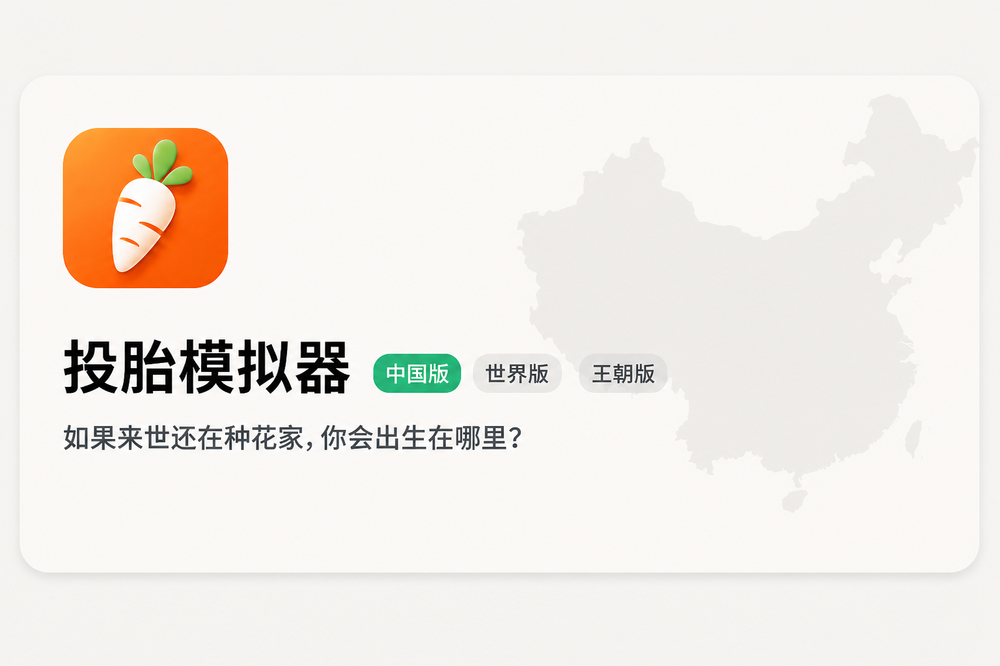
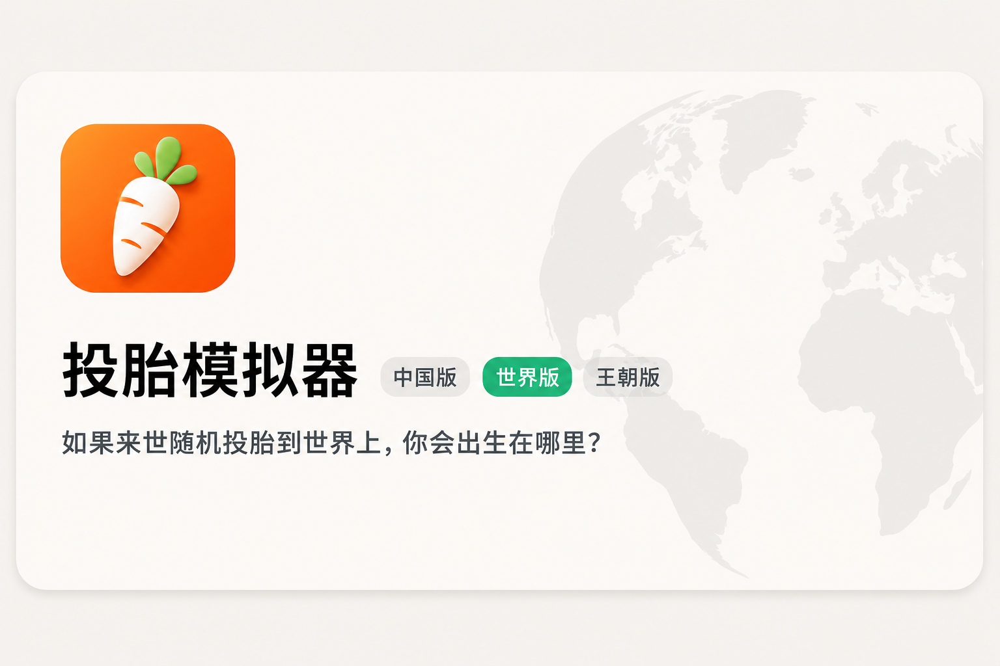
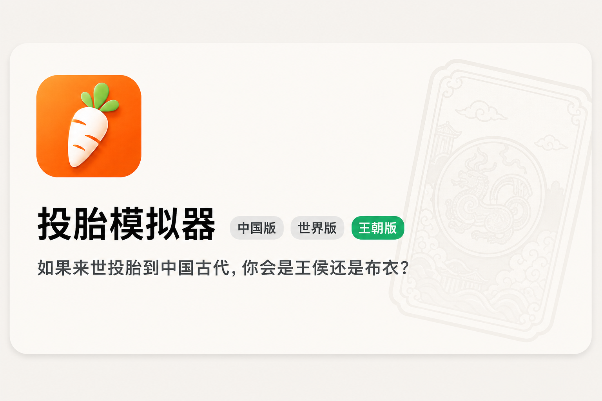

**项目网站**：https://toutai.online/

投胎模拟器：如果来世再投一次，你会出生在哪里？

顶部可在 **中国版**、**世界版**、**王朝版** 之间切换，玩法同构：点一次投胎，得到结果、记录和统计。

### 中国版

[](https://toutai.online/)

如果来世还在种花家，你会出生在哪里？

中国版根据公布的最新出生人口数据，模拟你在各省份 / 地区的出生地、性别、城乡（城市 / 城镇 / 乡村）与孩次。地图上会累计热力，也可查看省份分布和个人统计。

- 入口：https://toutai.online/
- 公式：该地区出生人口 ÷ 全国总出生人口

### 世界版

[](https://toutai.online/world)

如果来世随机投胎到世界上，你会出生在哪里？

世界版根据世界银行 2024 年全球人口与粗出生率，推算各国出生人口占比，并按大洲汇总。国名可在中文 / 英文间切换。

- 入口：https://toutai.online/world
- 公式：该国出生人口 ÷ 全球总出生人口

### 王朝版

[](https://toutai.online/dynasty)

如果来世投胎到中国古代，你会是王侯还是布衣？

王朝版按「国祚 × 代表人口」加权抽取秦至清 13 朝，再按各朝 6 阶社会分层抽取身份，性别各 50%。卷轴开箱后翻出结果卡，图鉴共 78 格，抽中后可分享海报。

- 入口：https://toutai.online/dynasty
- 图鉴：13 朝 × 6 阶；未抽中灰显，点击可翻面看历世记录
- 说明：阶级概率为示意性历史分层，非人口普查数据，仅供娱乐

### 数据来源

**中国版**

- 中国大陆：[第七次人口普查](https://www.stats.gov.cn/sj/pcsj/rkpc/7rp/zk/indexch.htm)（2019.11.1 - 2020.10.31）
- 香港特别行政区：[香港政府统计处](https://www.censtatd.gov.hk/tc/web_table.html?id=3)（2023）
- 澳门特别行政区：[统计暨普查局](https://www.dsec.gov.mo/zh-MO/Statistic?id=101)（2023）
- 台湾地区：[人口统计资料](https://www.ris.gov.tw/app/portal/346)（2023）

**世界版**

- [世界银行](https://data.worldbank.org/) 2024 年人口与粗出生率统计

**王朝版**

- 秦至清 13 朝 × 6 阶示意性历史分层模型，按「国祚 × 代表人口」加权；分裂政权已合并为三国、晋、南北朝、宋等条目

### 开发

- [Next.js](https://nextjs.org/)
- [TypeScript](https://www.typescriptlang.org/)
- 部署：[Cloudflare Pages](https://pages.cloudflare.com/)（静态导出）

```bash
npm install
npm run build:themes
npm run build
```

### 致谢

- 灵感来源：[uahh.site/reborn](https://uahh.site/reborn)
- 上游项目：[hahahumble/rebirth](https://github.com/hahahumble/rebirth)
