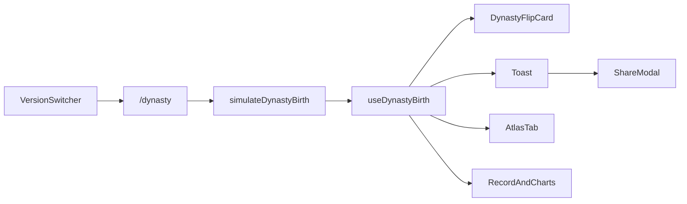

# 朝代版一键投胎设计

日期：2026-08-12  
状态：待用户审阅  
范围：投胎模拟器第三版「朝代版」——一键投胎 + 开箱翻卡 + 图鉴收集

## 目标与气质

在现有中国版 / 世界版之外增加 `/dynasty`，玩法同构（一键抽签 → 结果 → 记录/统计），地图位改为抽卡翻转。

气质：**稀有感 + 收集感 + 反差趣味**。视觉跟现站浅底 `#f5f3ef` + Reshaped 橙色体系统一，不另起暗黑/青瓷主题。

## 非目标（首版不做）

- 「过一生」事件 RPG、属性成长、自动推进
- 三套古风主题、音效、粒子、多卡扇形
- 历史疆域地图
- 图鉴齐套奖励、抽卡保底
- 与中国版 / 世界版共用同一结果 store

## 核心循环

1. 用户点击「投胎」或抽卡卡面。
2. `simulateDynastyBirth()`：八朝**均匀**抽取朝代 → 按该朝 `classes[].prob` **加权**抽阶级 → 性别 50/50；生成展示用姓名与出生年月。
3. `DynastyFlipCard` 按稀有度播放开箱动画，揭示结果。
4. Toast 报结果（含反差一句）；结果写入 `useDynastyBirth`。
5. 图鉴对应格点亮；Tabs 更新记录与分布。

## 稀有度色阶（方案 C · 浅底朱印）

红为最高档。卡面边框、朱印、轻晕使用下列色：

| 等级 | 戳印 | 主色 |
|------|------|------|
| 1 | 王侯将相 | 朱红 `#b91c1c` / `#dc2626` |
| 2 | 官宦士绅 | 琥珀 `#b45309` / `#d97706` |
| 3 | 平民百姓 | 站点橙 `#ff4f04` / `#ea580c` |
| 4 | 贱籍流亡 | 石色 `#a8a29e` / `#78716c` |

## 开箱翻卡（方案 2 · 开箱加戏）

技术：CSS `perspective` + `rotateY` + `backface-visibility`，不引入 framer-motion。

| 条件 | 表现 |
|------|------|
| 等级 1–2 | 边框切到目标色 + 轻微抖动 200–300ms，再翻面；晕光较强 |
| 等级 3–4 | 直接短翻，无蓄力 |
| `rapidMode` 连点 | 全档位统一短翻约 150–200ms，跳过蓄力 |
| `prefers-reduced-motion` | 跳过抖动与翻面，直接显示正面 |
| 无记录首次进入 | 卡背朝上 |
| 有历史回访 | 默认展示最近一次正面；再抽时先翻回背再揭示 |

卡背：浅底统一纹样 + 站点小标 / 「投胎」。  
卡面：朝代名与年代、阶级名与朱印、性别与姓名、本次概率。  
卡片与按钮共用 `handleRebirth`；非 rapid 时动画进行中忽略重复点击。

## 图鉴

- Tab 名「图鉴」；8 朝 × 4 阶 = 32 格。
- 未抽中灰显；抽中按上表色阶点亮；可选次数角标。
- 点亮键：`(dynastyId, classLevel)`；由历史记录推导，无独立图鉴 store。
- 重置 `useDynastyBirth` 后图鉴全灰。

## 页面与 Tabs

主页 `/dynasty`（镜像世界版布局）：

1. 顶部 `DynastyFlipCard`
2. 「投胎」按钮 + `useRebirthPress`
3. 摘要条（如朝代次数占比）
4. Tabs：投胎记录 | 朝代分布 | 阶级分布 | 图鉴 | 第一次出现

副页：

- `/dynasty/about`：玩法、模型说明、重置
- `/dynasty/data`：数据说明；**明确阶级概率为示意性历史分层，非人口普查**
- `/dynasty/probability`：查询指定朝代 + 阶级的理论概率

导航：VersionSwitcher 增加「朝代版」；Navbar 在朝代版下链到上述副页。

## 数据与状态

- `app/_data/dynasties.json`：自原型 HTML 抽出 8 朝 × 4 阶级（去掉 `mods`）。
- `app/_lib/dynasty-rebirth.ts`：`DynastyBirthResult`、`simulateDynastyBirth`、`getDynastyClassProbability`；结果概率 = `(1/8) * class.prob * 0.5`（朝代均匀 × 阶级权重 × 性别）。
- `app/_lib/store/useDynastyBirth.ts`：persist + `capRecords`，与中国版隔离。
- `AppVersion` 扩展为 `'china' | 'world' | 'dynasty'`；`resolveAppVersion` 识别 `/dynasty` 前缀。

## Toast 与分享

- Toast：第 N 次投胎 + 朝代/阶级/戳印 + 反差一句（低档调侃、高档欧气）。
- ShareModal `mode: 'dynasty'`：静态文案卡，朱印色点缀；无地图、无翻转动画。

## 主要新增文件

- `app/_data/dynasties.json`
- `app/_lib/dynasty-rebirth.ts`
- `app/_lib/store/useDynastyBirth.ts`
- `app/(home)/dynasty/`（page、client、about、data、probability）
- `app/_components/dynasty-flip-card.tsx`（+ 少量 CSS）
- `app/_components/dynasty-atlas.tsx`
- `dynasty-result-table` / `dynasty-bar` / `dynasty-first-time-table`

改动现有：`useAppVersion`、`version-switcher`、`title`、`navbar`、`app-version-hydrator`、`share-modal`、`useShareModal`、`reset-modal`、`site.ts`。

## 验收要点

- 三版切换正常；朝代版静态导出可构建。
- 单抽：高档有蓄力，低档短翻；连点不卡动画队列。
- 图鉴点亮与重置正确。
- data 页有示意性概率免责声明。
- reduced-motion 下无强制动画。
